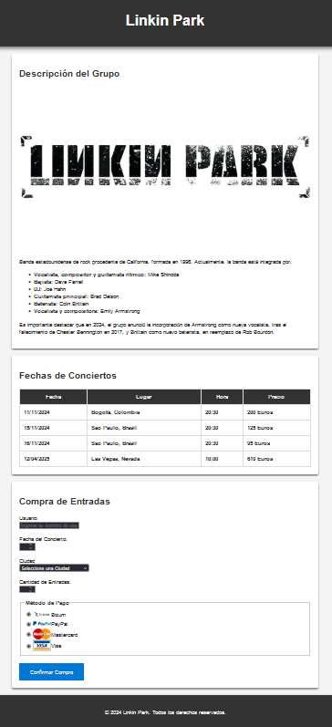
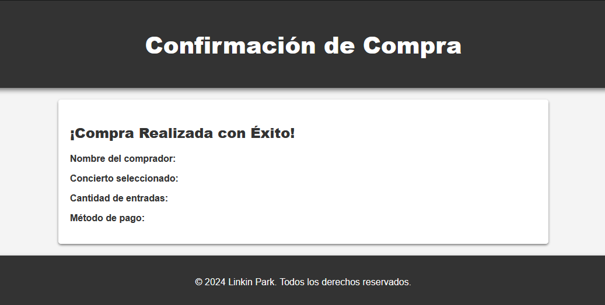

# 🎸 Linkin Park Fan Page 🎶

Este proyecto web presenta una página de confirmación de compra y descripción para conciertos de Linkin Park. Permite ver información sobre el grupo, fechas de conciertos y realizar una simulación de compra de entradas.

## 📂 Archivos

- **`Confirmacion_Compra.html`** - Página de confirmación de compra que muestra los detalles del comprador y el concierto seleccionado.
- **`Descripción_Compra.html`** - Página de descripción con información sobre el grupo Linkin Park y las fechas de conciertos programadas.
- **`CSS_Descripción_Confirmacion.css`** - Hoja de estilos CSS que da un diseño moderno y atractivo a ambas páginas HTML.

# 🎸 Linkin Park Fan Page 🎶

¡Bienvenido! Este es mi **primer proyecto** de la asignatura **Desarrollo de Aplicaciones Multiplataforma (DAM)** en el CFGS. La actividad me ha resultado muy divertida, ya que he podido ver el resultado en pantalla a medida que escribía el código, lo cual es muy gratificante.

Esta web permite explorar información sobre **Linkin Park**, visualizar fechas de sus próximos conciertos, y simular una compra de entradas. ¡Ideal para los fans! 🤘

---

## 📂 Archivos del Proyecto

- **`Confirmacion_Compra.html`** - Página de confirmación de compra, donde se muestran los detalles del usuario y del concierto seleccionado.
- **`Descripción_Compra.html`** - Página de descripción del grupo Linkin Park, con una lista de los miembros y detalles de sus próximos conciertos.
- **`CSS_Descripción_Confirmacion.css`** - Hoja de estilos que da un toque moderno a la web.

---

## 🎨 Estilo y Diseño Visual

La hoja de estilos da un look limpio y profesional a las páginas HTML con:

- **Encabezados en fondo oscuro** y sombras para un aspecto elegante.
- **Tablas personalizadas** para mostrar información clara sobre los conciertos.
- **Formulario de compra** con iconos visuales para métodos de pago (Bizum, PayPal, Mastercard y Visa) para mejorar la experiencia del usuario.

---

## 📸 Vistazo a la Página

| Descripción                        | Confirmación                        |
|------------------------------------|-------------------------------------|
|  |  |

---

## 🚀 Ejecución del Proyecto

1. Clona este repositorio:
    ```bash
    git clone https://github.com/@Jorx8819/LinkinParkFanPage.git
    ```

2. Abre los archivos HTML en tu navegador para ver cada sección:
   - **Descripción**: `Descripción_Compra.html`
   - **Confirmación**: `Confirmacion_Compra.html`

---

## 🛠️ Tecnologías Utilizadas

<div align="center">
  
  
</div>

---

## 🌟 Reflexión y Agradecimientos

Este primer ejercicio en DAM me ha permitido conectar con el desarrollo web de una forma muy visual. Me ha encantado poder ver lo que creo en tiempo real mientras escribo el código. Gracias a **Linkin Park** por la inspiración en esta divertida actividad que me ha permitido aprender y disfrutar al mismo tiempo. 🎉

---

💻 [Visita mi GitHub](https://github.com/@Jorx8819)

